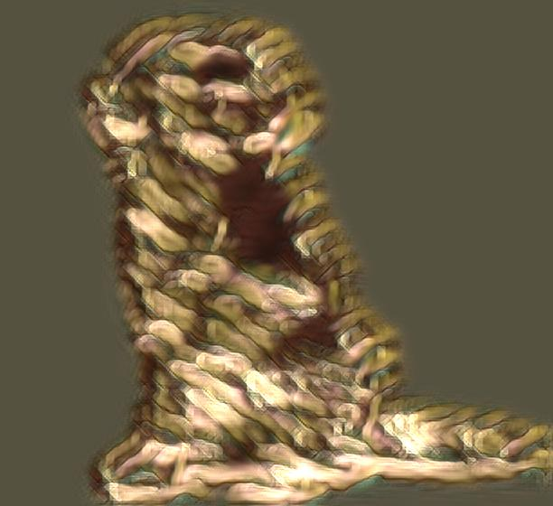

# 🎨 Fast Neural Style Transfer

This project implements an **artistic style transfer system** using **PyTorch**, using the method of **Transfer-Learning** taking as the base the **[pytorch/examples](https://github.com/pytorch/examples/tree/main/fast_neural_style)** implementation of the method, which allows to combine the content of one image with the artistic style of another.  
The trained models can be used directly through a **Streamlit web app** or via Python scripts (locally), making the project interactive and easy to use both locally and in the cloud.

---

## 🚀 Features

- Train **style transfer networks** from scratch using **COCO 2017 dataset** or custom datasets.
- Pretrained models available for classic styles such as:
  - 🎨 *Candy*
  - 🎨 *Mosaic*
  - 🎨 *Udnie*
  - 🎨 *Rain Princess*
  - 🎨 *Monet* (custom trained)
  - 🎨 *Michelangelo* (custom trained)
- Two different transformation architectures:
  - **TransformerNet** → lightweight style transfer (Monet)
  - **TransformerNet_v2** → deeper architecture for more detailed styles (Michelangelo)
- Loss network based on **VGG19** (perceptual loss).
- Real-time **style application** through **Streamlit** web interface.
- Support for **saving and resuming checkpoints**.


---

## 📂 Repository Structure
<pre>
  ├── images/ # Example input/output images.
  ├── pages/ # Extra Streamlit pages.
  ├── saved_models/ # Pretrained and custom-trained .pth models.
  ├── main.py # Streamlit web application.
  ├── neural_style.py # Training and evaluation script.
  ├── style.py # Helper functions for style application.
  ├── transformer_net.py # Style transfer network (base).
  ├── transformer_net_v2.py # Alternative deeper architecture.
  ├── utils.py # Utility functions (Gram matrix, normalization, etc.).
  ├── vgg16.py # VGG16 loss network (baseline).
  ├── vgg19.py # VGG19 loss network (final used).
  ├── requirements.txt # Project dependencies.
  └── README.md # Project documentation.
</pre>

---

## ⚙️ Installation

Clone the repository:

```bash
git clone https://github.com/Angomezp/fast_neural_style.git
cd fast_neural_style
```

Create a virtual environment and install dependencies:
```bash
pip install -r requirements.txt
```

## 🏋️ Training your own model.

To train a new style model:
```bash
python neural_style.py train \
  --dataset "C:/path/to/dataset" \
  --style-image "C:/path/to/style.jpg" \
  --save-model-dir saved_models \
  --checkpoint-model-dir checkpoints \
  --epochs 2 \
  --batch-size 4 \
  --image-size 256 \
  --style-size 256 \
  --accel
```

--dataset: folder containing training images (e.g., COCO 2017).

--style-image: style reference image (e.g., Monet painting).

--save-model-dir: where to save the final trained model.

--checkpoint-model-dir: save intermediate checkpoints.

--accel: use GPU acceleration if available.

## 🎨 Stylization

Apply a pretrained model to a content image:

```bash
python neural_style.py eval \
  --content-image "images/input.jpg" \
  --model "saved_models/mosaic.pth" \
  --output-image "images/output.jpg"
```

## 🌐 Streamlit Web App

Run the interactive web app:

```bash
streamlit run main.py
```

-Upload a content image.

-Choose a style model (Candy, Mosaic, Monet, Michelangelo, etc.).

-Download or view the stylized result in real time.

## 📊 Training Configuration (default)

- Optimizer: SGD with momentum 0.99

- Learning rate: 0.05
  
- Batch size: 10

- Epochs: 50

- Loss network: VGG19

- Loss functions:

  - Content Loss: activations from relu2_2

  - Style Loss: Gram matrices across layers

  - Total Variation Loss (optional)

## 📌 Results

Example:

| Original | Stylized(Michelangelo) |
|--------|--------|
|  |  |


	
## 📚 References

Johnson, Justin, et al. "Perceptual Losses for Real-Time Style Transfer and Super-Resolution." (2016).

Ulyanov, Dmitry, et al. "Instance Normalization: The Missing Ingredient for Fast Stylization." (2017).

PyTorch official implementation: [pytorch/examples](https://github.com/pytorch/examples/tree/main/fast_neural_style)
